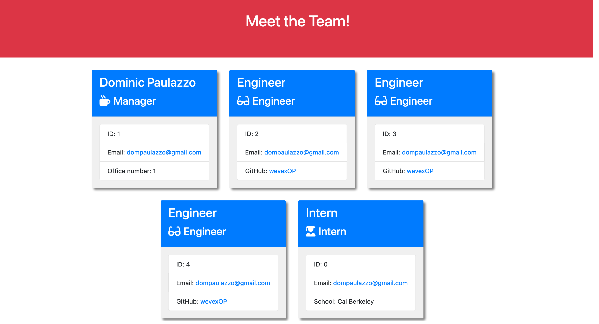

# Team Project Generator App!

## Description

The purpose and functionality of this app is to create an easy and useful too for categorizing all of the employees and their roles in the workspace. This too not only allows you to build teams but also stay connected with them by getting all of their contact information bundled with their identification card of the web page. Check out the app today!

## Table of Contents

- [Example](#example)
- [Demo](#demo)
- [Programs Used](#programs-used)
- [Credit](#credit)

## Example
Below is an example screenshot of the web application.

## Demo

Check out the applications in action here!----> https://youtu.be/k_HjWnLx2H0

## Programs Used

- Inquirer: https://www.npmjs.com/package/inquirer
- Jest: https://www.npmjs.com/package/jest
- Bootstrap: https://getbootstrap.com/
- NodeJS: https://nodejs.org/en/

## Credit

Created by: Dominic Paulazzo
GitHub: https://github.com/wevexOP
Email: dompaulazzo@gmail.com
Discord: Romulus#6003

    
